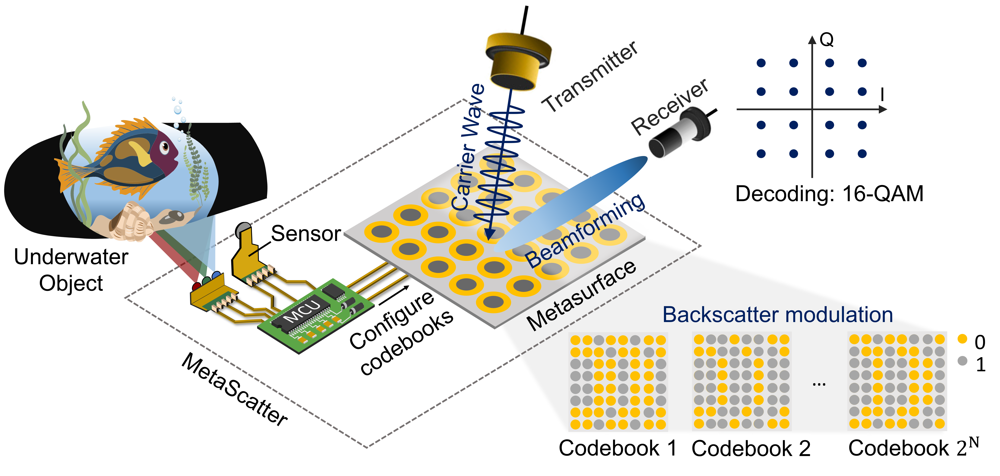
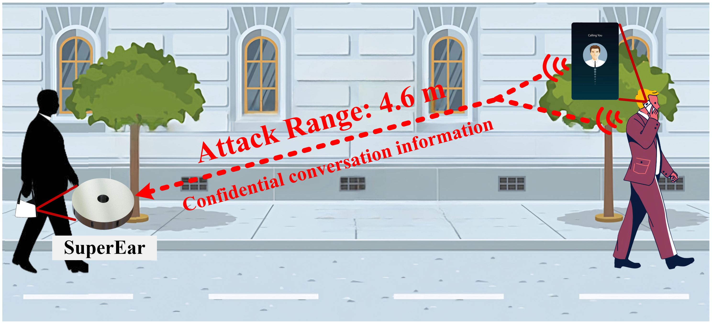
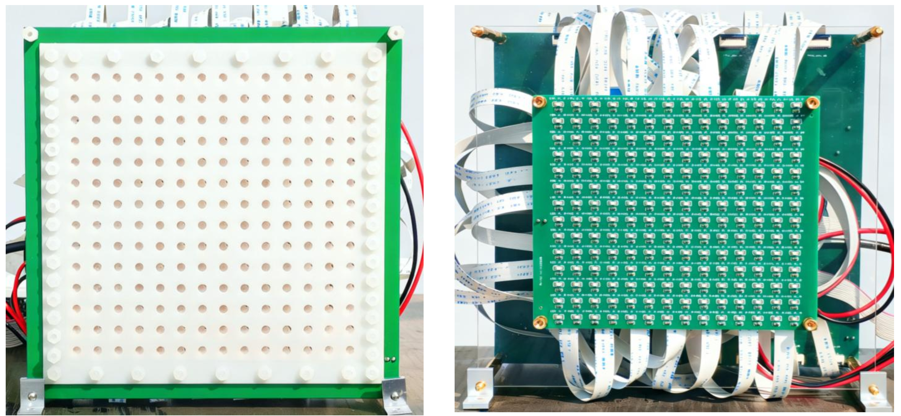
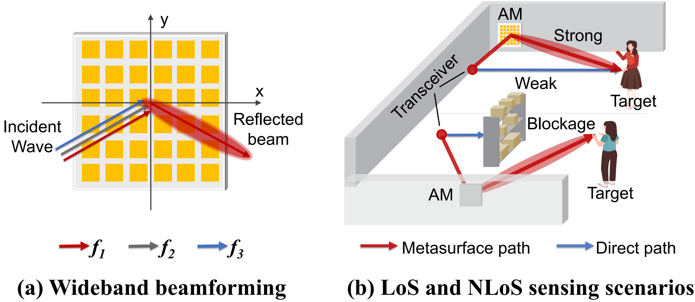
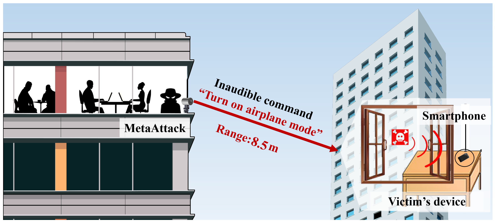








# About Me

Juan He is now a PhD student at Northwest University, under the supervision of Prof. Xiaojiang Chen.

My research focuses on acoustic metasurface-enabled sensing, communication, and physical neural networks for low-power and intelligent edge systems.
🔥🔥🔥 I am currently seeking a postdoctoral research opportunity. If you have a suitable opportunity or know of any openings, please feel free to contact me [*hejuan@stumail.nwu.edu.cn*].

# 🔥 News
- *2026.01*: 🎉🎉 Our work **Metascatter** is accepted by Mobicom 2026. 

# 📝 Publications 

## 🗞️ Conference

MobiCom 2026

  

 [**MetaScatter: Enabling High-Order Underwater Backscatter via Piezoelectric Metasurface**](https://hejuan94.github.io/Papers/XX.pdf)
 
**[Juan He]**, Jie Xiong, Wenhao Liu, Xuan Wang, Xiaoyan Wang, Na Chen, Chen Liu, Chunlong Fei, Chao Feng, Xiaojiang Chen

**ACM Mobicom 2026 (CCF A)**

- Underwater Backscatter.
- Acoustic Metasurface.

WWW 2026

  

 [**SuperEar: Eavesdropping on Mobile Voice Calls via Stealthy Acoustic Metamaterials**](https://hejuan94.github.io/Papers/XX.pdf)
 
Zhiyuan Ning, Zhangyong Tang, **[Juan He]**, Weizhi Meng, Yuntian	Chen, Jie	Zhang, Zheng Wang

**ACM WWW 2026 (CCF A)**

- Acoustic Eavesdropping.
- Acoustic Metamaterials.

Sensys 2026 Poster

  

 [**Poster Abstract: A Configurable Piezoelectric Acoustic Metasurface for Real-Time Tracking**](https://hejuan94.github.io/Papers/XX.pdf)
 
**[Juan He]**, Hao Yu, Jiameng Bai, Chen Liu, Xiaoqing Gong, Chao Feng

**ACM Sensys Poster 2026 (CCF B)**

- Piezoelectric Metasurface.
- Real-time Tracking.

MobiSys 2024

 

 [**CW-AcousLen: A Configurable Wideband Acoustic Metasurface**](https://hejuan94.github.io/Papers/XX.pdf)
 
**[Juan He]**, Jie Xiong, Weihang Hu, Chao Feng, Enjie Yao, Xiaojing Wang, Chen Liu, Xiaojiang Chen

**ACM Mobisys 2024 (CCF B)**

- Acoustic Metasurface.
- Acoustic Sensing.

## 📑 Journal

TIFS 2025

  

 [**A Portable and Stealthy Inaudible Voice Attack Based on Acoustic Metamaterials**](https://hejuan94.github.io/Papers/XX.pdf)
 
Zhiyuan Ning(Equal Contribution), **[Juan He (Equal Contribution)]** , Zhanyong Tang , Weihang Hu , and Xiaojiang Chen

**TIFS 2025 (CCF A)**

- Acoustic Metamaterials.
- Inaudible Voice Attack.

# 🎖 Honors and Awards

# 📖 Educations
- *2019.06 - now*, PhD in Software Engineering (Supervisor: Xiaojiang Chen), Northwest University.
- *2017.09 - 2019.06*, Master in Software Engineering (Supervisor: Xiaojiang Chen), Northwest University.

# 💬 Invited Talks

# 💻 Internships
